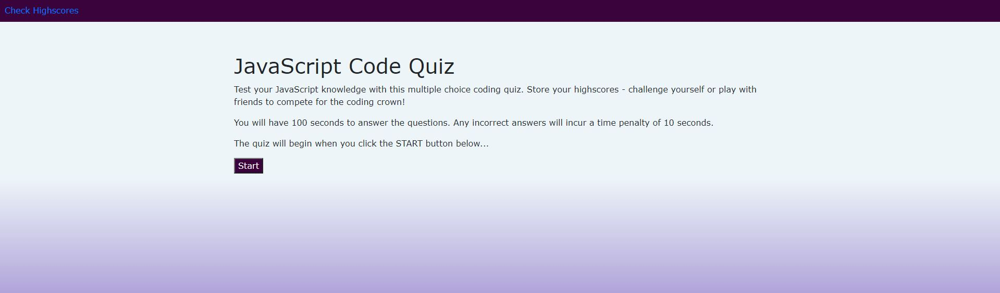
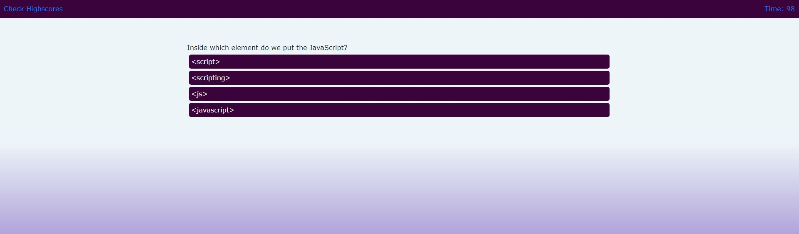
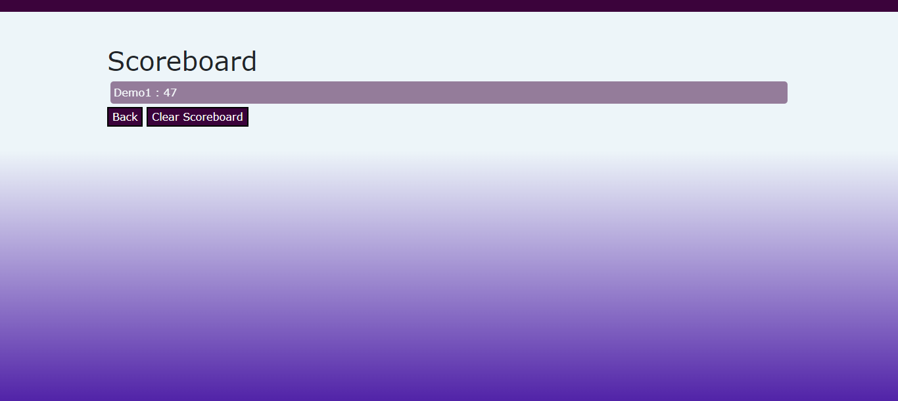
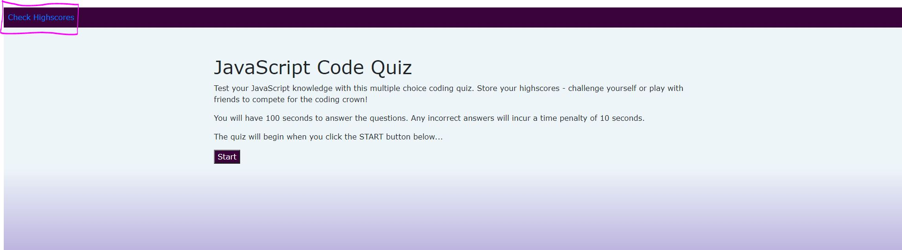

# JAVSCRIPT QUIZ
Vienna Borowska - University of Manchester Coding Bootcamp - vienna.borowska@hotmail.com

## DEPLOYED URL
https://viennaborowska.github.io/Javascript-Quiz/

## LANGUAGE
HTML, CSS & JavaScript

## APIs
JQuery
Bootstrap

## FILES
* README.md - contact information, file information
* index.html - HTML code
* style.css - CSS stylesheet
* script.js - JavaScript file
* scoreboard.html - separate HTML page for scoreboard
* scoreboard.js - separate JavaScript file for scoreboard page

# Table of Contents

- [Installation](#description)
- [Usage](#usage)
- [Contributing](#contributing)
- [Questions](#questions)

## DESCRIPTION
This site uses HTML, CSS and JavaScript to build a Javascript quiz. This site utilises APIs to make dynamic changes to HTML using JavaScript.

## USAGE
### Users are presented with a start page with some quiz information, a start button, and a navigation bar to check stored highscores:

  

### Once the start button is clicked, the quiz begins and the first question is loaded to the page:

 

### Time (10s) is deducted for incorrect answers and once the quiz is finished the user is taken to a summary screen and a prompt to submit their score:

 

### Once the user has input their details and clicked 'Submit', they are taken to the Scoreboard page:

 

### A user can also access the Scoreboard page from the start page - link in navbar:

 

## Contributing

Contributions and improvements are always welcome. Please clone/fork the repo. Any suggestions or feedback, please do get in touch.

## Questions

If you have any questions about this projects, please contact me directly via the channels below:  
Email: viennabdev@gmail.com. 
You can view more of my projects at https://github.com/ViennaBorowska.
